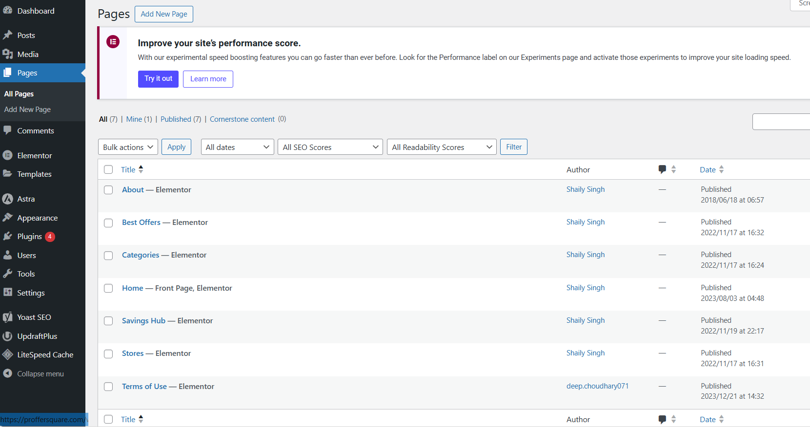
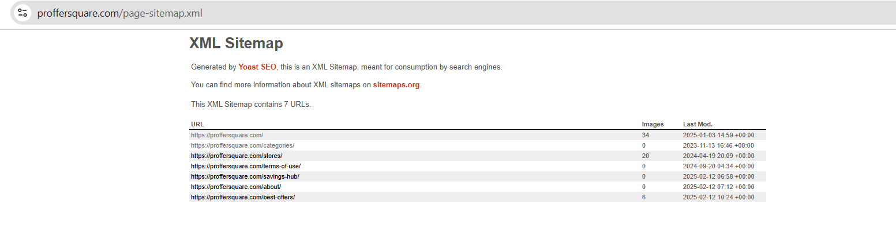
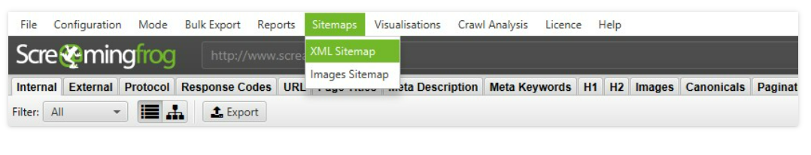

# How To Find All Pages on ProfferSquare (WordPress Site)

## Overview

For ProfferSquare, consistent monitoring of all pages is essential for SEO, content organization, and troubleshooting. This guide outlines the methods used to list every page on the WordPress site.

## Method 1: Using the WordPress Dashboard

### Steps:

1.  Log in to the ProfferSquare WordPress Admin Panel.
2.  Navigate to `Pages` → `All Pages`.
3.  Review the list of all published, draft, and pending pages.

This section provides an overview of all static pages, including those not in the main navigation.

*WordPress dashboard showing all pages.*

### Expected Result:

A clear list of all ProfferSquare pages, sorted by title, author, and publication date, is displayed.

## Method 2: Checking the Sitemap

The sitemap, an essential XML file, lists all URLs. It is used to ensure search engines can easily crawl ProfferSquare.

### Steps:

1.  Navigate to the sitemap URL: `https://proffersquare.com/sitemap.xml`.
2.  Alternatively, for sites using Yoast SEO, access it under `SEO` → `General` → `Features`.

*XML sitemap for ProfferSquare.*

### Expected Result:

A structured list of all ProfferSquare pages, including posts, tags, and categories, is generated.

## Method 3: Using the Yoast SEO Plugin

Yoast SEO is crucial for sitemap management, as the theme does not generate one automatically.

### Steps:

1.  Ensure Yoast SEO is installed and activated.
2.  Access the sitemap settings via `SEO` → `General` → `Features`.

*Yoast SEO sitemap settings.*

### Expected Result:

Yoast SEO generates and updates the XML sitemap, ensuring all pages are included.

## Method 4: Using Screaming Frog

For larger sites like ProfferSquare, a web crawler tool aids in finding pages that might be missed.

### Steps:

1.  Use Screaming Frog, which should be downloaded and installed.
2.  Enter `proffersquare.com` and initiate the crawl.
3.  The tool generates a detailed list of all discovered pages.

*Screaming Frog settings for generating sitemaps.*

### Expected Result:

A comprehensive list of all ProfferSquare pages, including hidden and orphaned ones, is produced.

## Conclusion

These methods facilitate the identification of all pages on ProfferSquare. This information is vital for content audits, SEO improvements, and overall website management.

ProfferSquare optimization is an ongoing process. 
